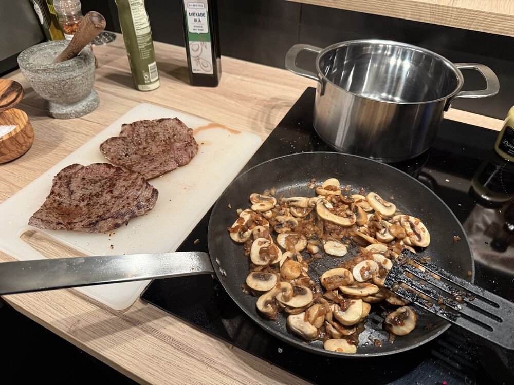
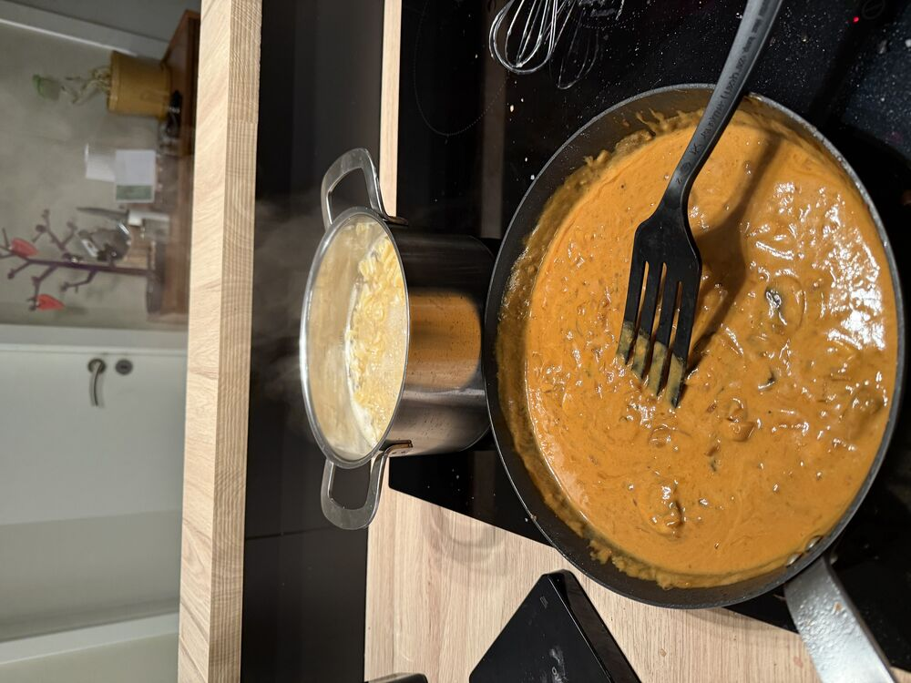
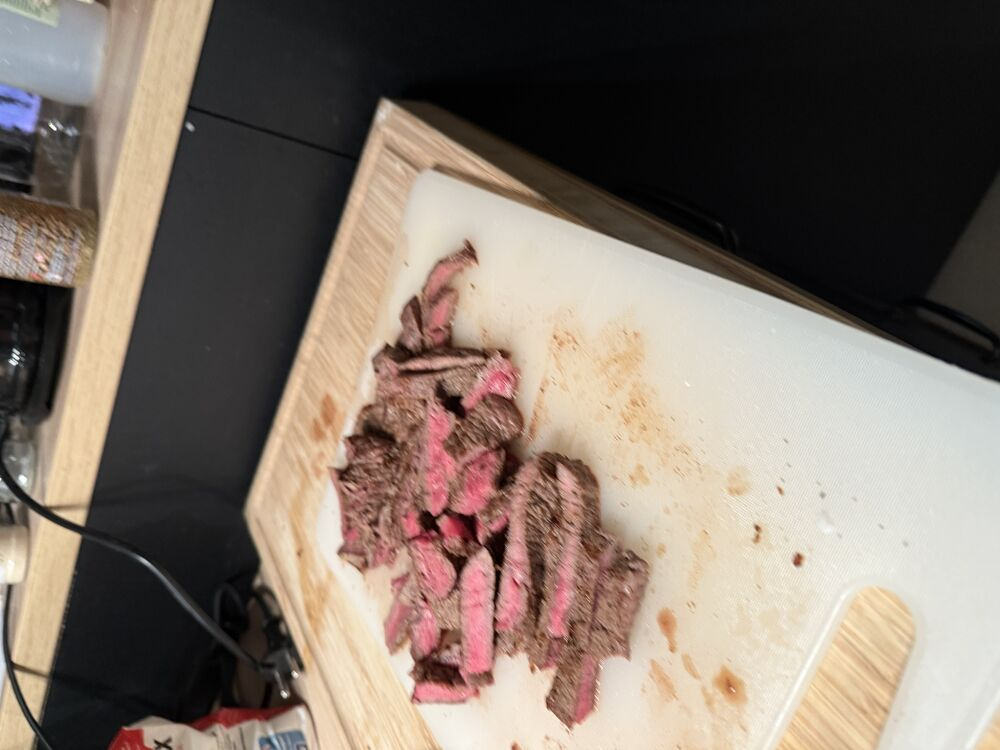

## Instructions

1) Þurrka, Fork-a, krydda (salt og pipar) kjötið
2) Steikja kjöt í ca. 2 mín. á hlið
	1) Kvíla á meðan restin er græjuð
3) Steikja laukinn í 1 tbsp olíu (~5 mín)
4) Bæta Sveppum með annari 1 tbsp olíu (~5-10 mín)
5) Byrja sjóða vatn fyrir pasta
6) Bæta hvítlauk og steikja í 2 mín
7) Bæta 1 tbsp tómat paste og steikja í 2-3 mín
8) Bæta hveiti og steikja í nokkrar mín
9) Bæta soði
10) Bæta W-sauce og soya + Dijon og láta malla
11) Skera kjöt í bite size bita
12) Hella mest af pasta vatni af pasta (ekki allt) og bæta smjöri í pottinn
	1) Hæra of emolshia smjör
13) Bæta sýðum og blanda vel
14) Bæta kjöti og ná hita aftur (2-3 mín)

   

   

   

# Lifesum

## Tips

> - Gott að nota hvítvín
