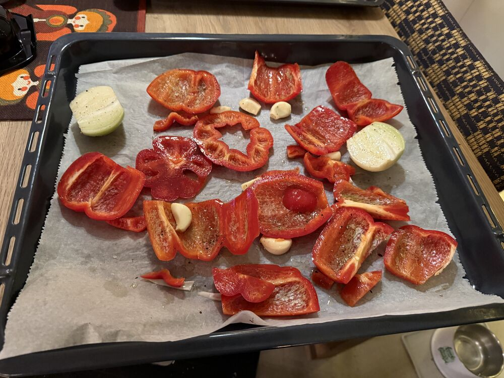
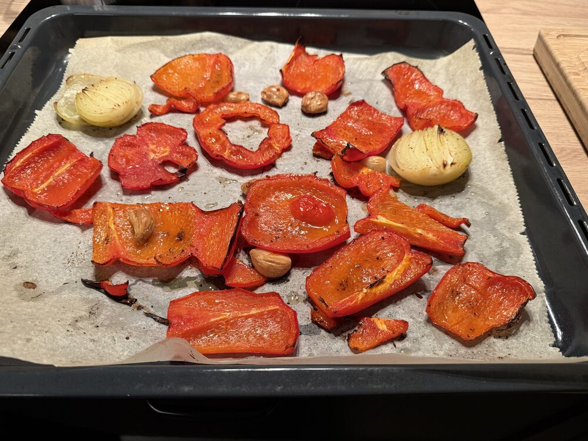
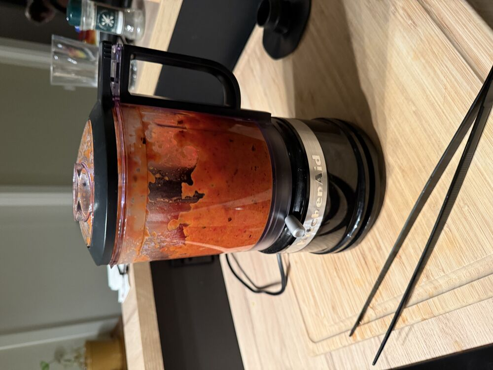
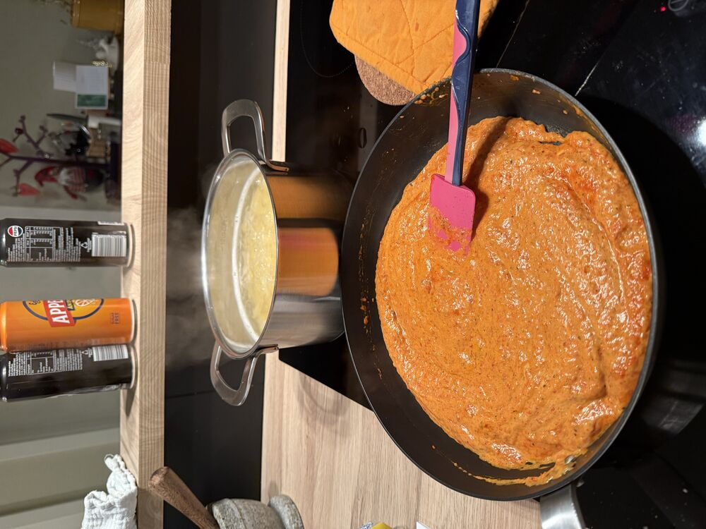
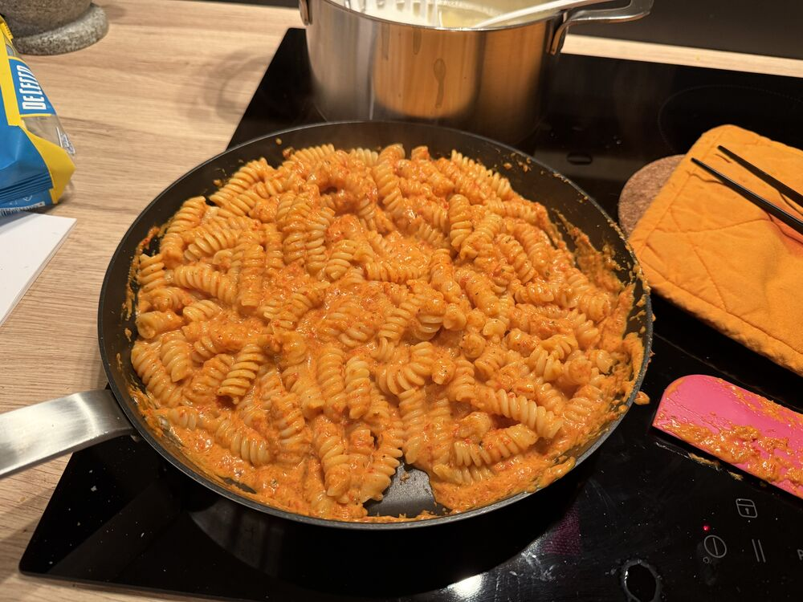

## Instructions

> [!tip] Gleymdi parmasan

1) Skera papriku, lauk, hvítlauk
2) Velta úr olíu, salt og pipar
3) Roast-a grænmeti í ofni 220C í 30 - 40 mín
	1) Má setja broiler á í endann til að fá meira broil
4) Þegar grænmetið er að verða tilbúið er gott að byrja að sjóða vatn fyrir pasta
5) þegar grænmeti er komið úr ofninum skella því öllu í blandara og blanda þar til smooth.
6) Setja grænmeti í pönnu og blanda vel saman rjómaostinum
7) Þegar pasta er nánast full eldað bæta því út í pönnuna með pasta vatni
8) Toss til smooth
9) Toppa með parmesan
 

   

   

   

   

   

# Lifesum
