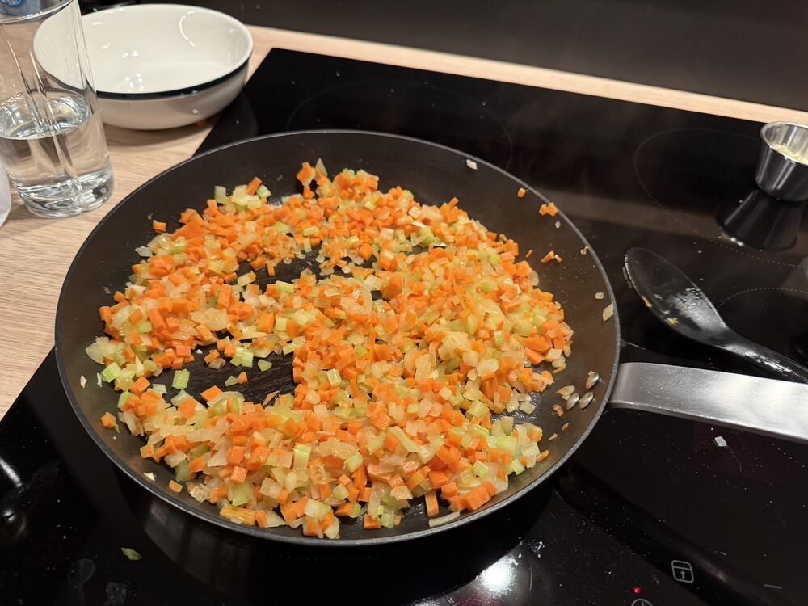
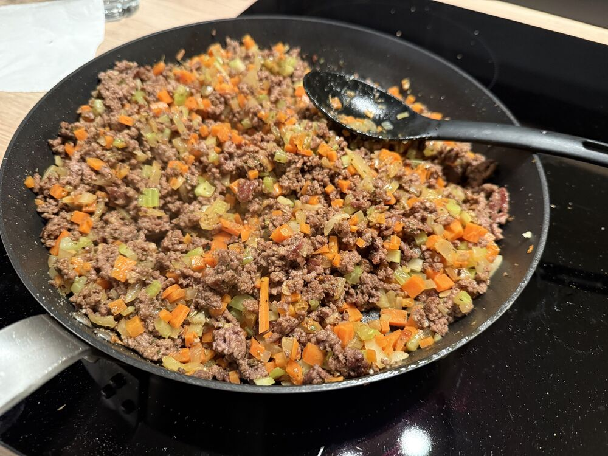
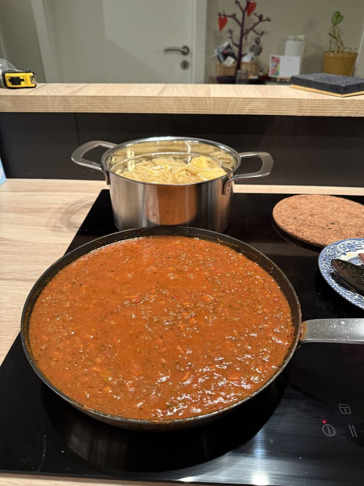

## Instructions

1) Cut vegetables
2) Sauté onions in 1 tbsp. oil for ~5mins.
3) Add carrots & celery and sauté for another ~5mins.
4) Add garlic and sauté for 1-2min.
5) Remove vegetables from pan and store in bowl
6) Brown the beef
	1) Spice to taste
7) Add back vegetables mix well.
8) Add tomato concentrate mix well and cooked for a few minutes
9) Add crushed tomatoes and stock
10) Worcestershire + Dijon + Ketchup + Milk
11) Cook covered at low heat for as long as you have time for.
12) Cook uncovered to desired thickens (~20 mins.)
13) Cook pasta

   

   

   

1) Add on portion of bolognese (~233gr.) and portion of pasta (~250gr.) to a pan and add ~2 ladles of starchy pasta cooking water and toss till emulsified.
2) Serve topped with parmesan (NOT optional) and parsley (optional)
 
# Lifesum

## Tips

> - - Dry pasta: 370gr - Cooked 790gr.
> - -	~ 250gr. cooked pasta per/portion
> - - 233gr.  Bolognese per/portion
