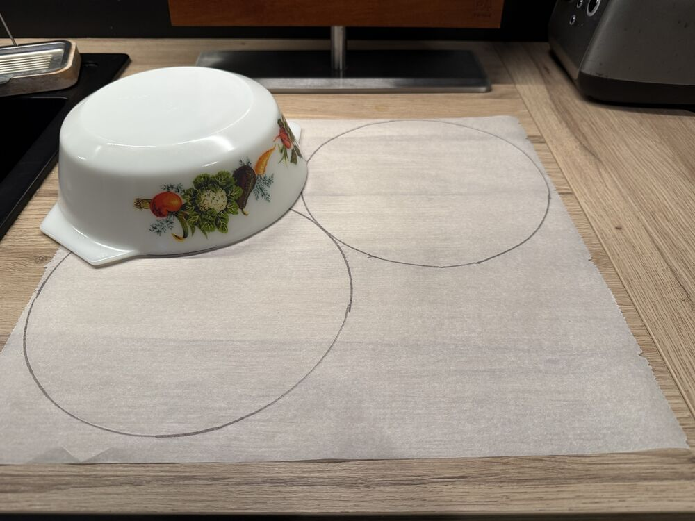
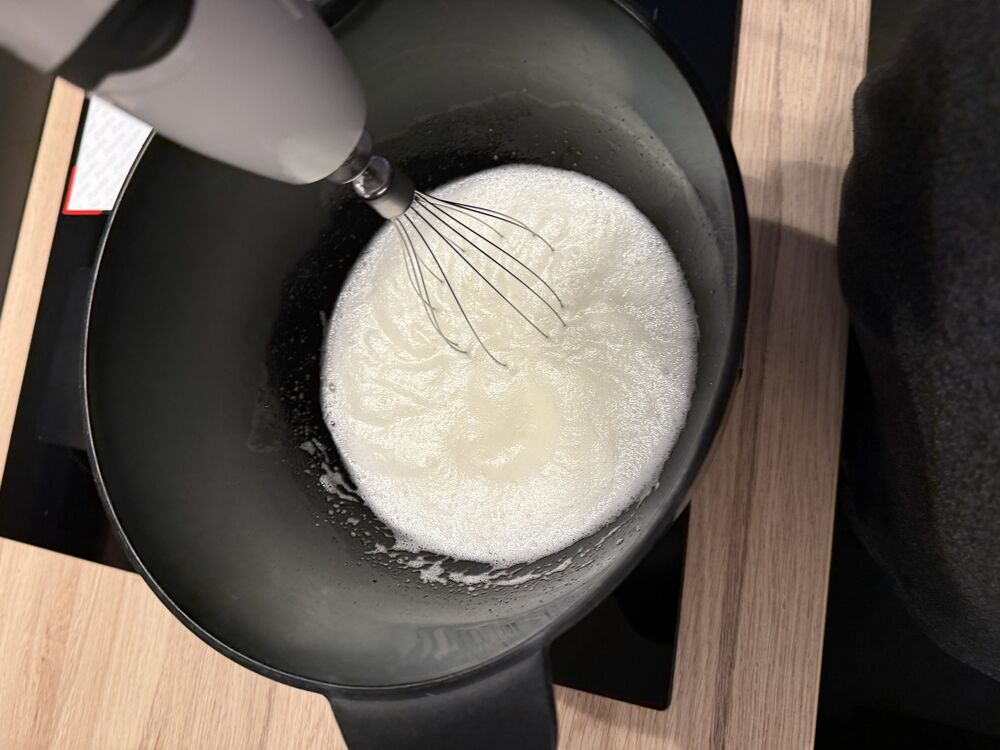
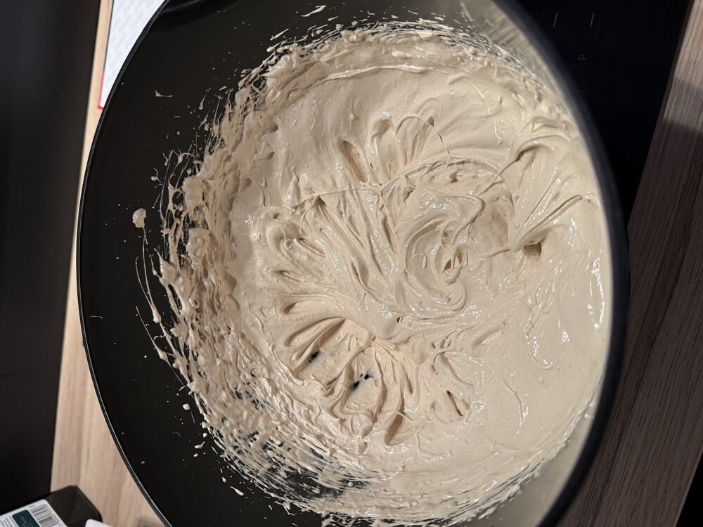
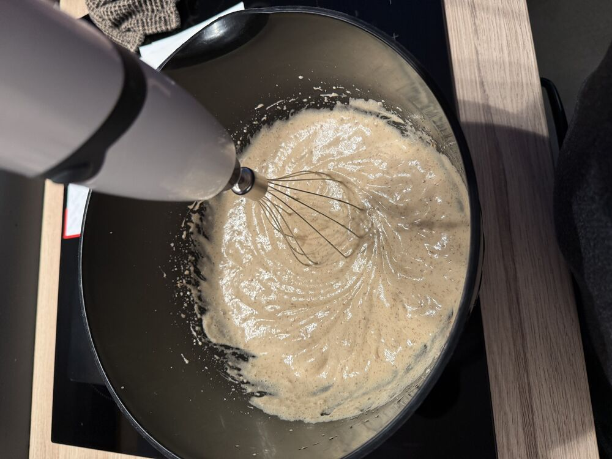
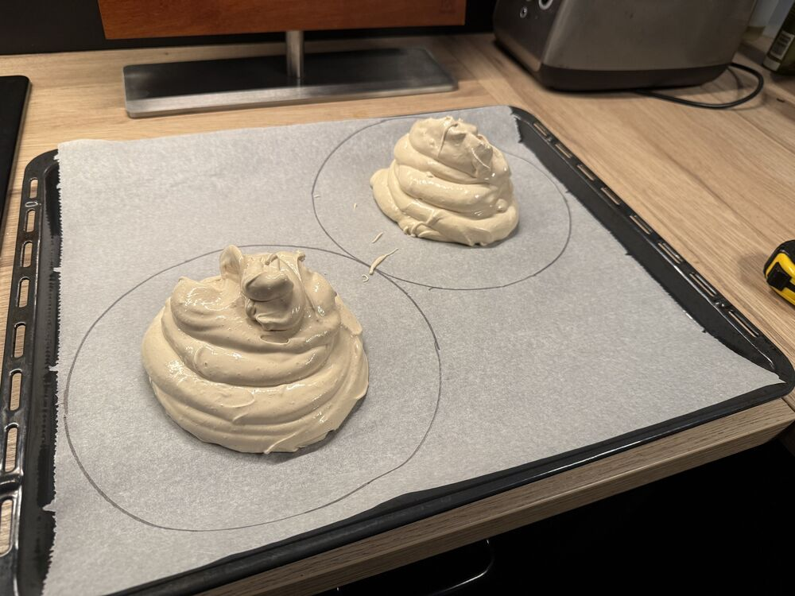
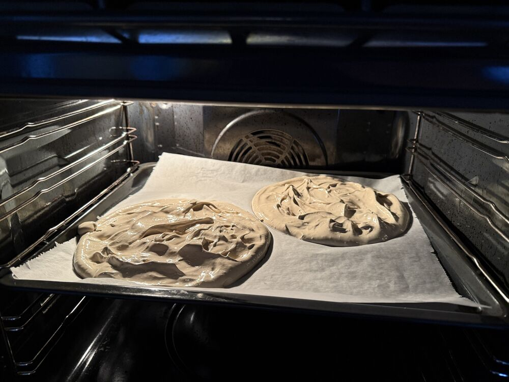

## Instructions

- þeyta eggjahvítur aðeins
- Bæta púðursykur útí rólega og halda áfram að þeyta
- Þeyta þar til marengs er orðin stífur
- Inní 145-150C ofn (ekki blástur) í 50-60mín
- 2x 22.5cm hringir

   

   

   

   

   

   
