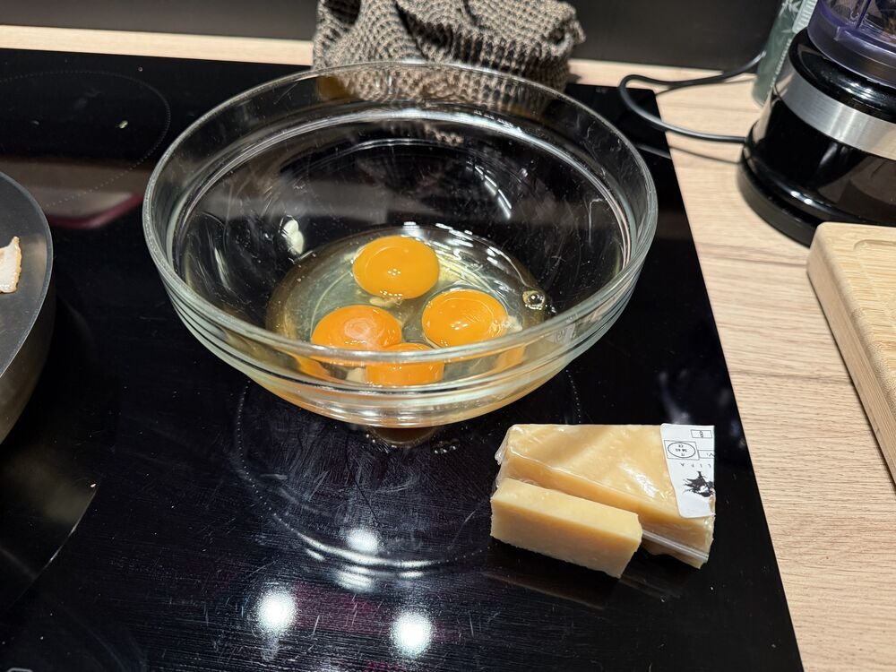
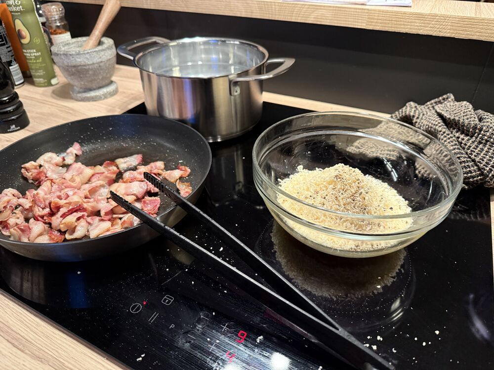
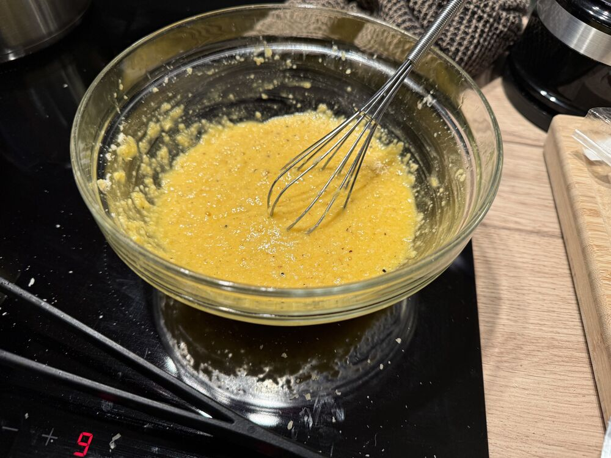
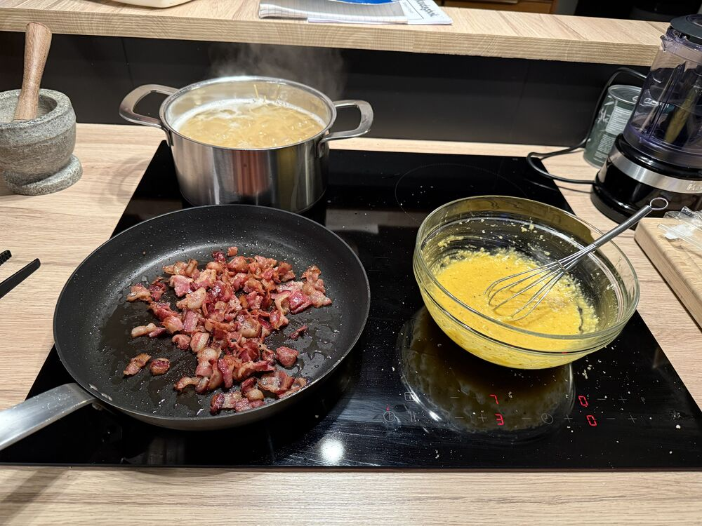
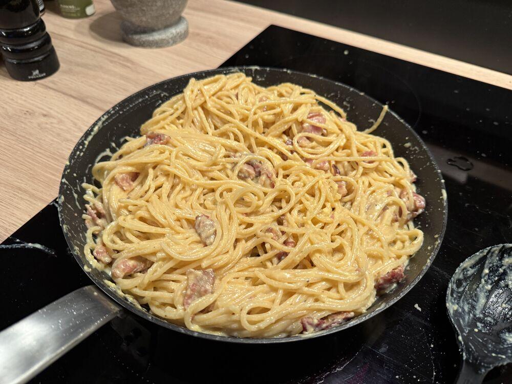

## Instructions

1)  Fry bacon
2)  Start boiling pasta
3)  In a bowl mix egg, egg yolks and parmesan. Whisk and add pepper.
4) Drain bacon fat
5) Temper egg by adding hot starchy pasta cooking water. A little at a time to ensure not to cook the eggs.
6) Add spagetti to pan with the bacon and toss with the carbonara mixture. Add pasta cooking water until smooth.

   

   

   

   

   

# Lifesum

## Tips

> - Hard in a small pan
