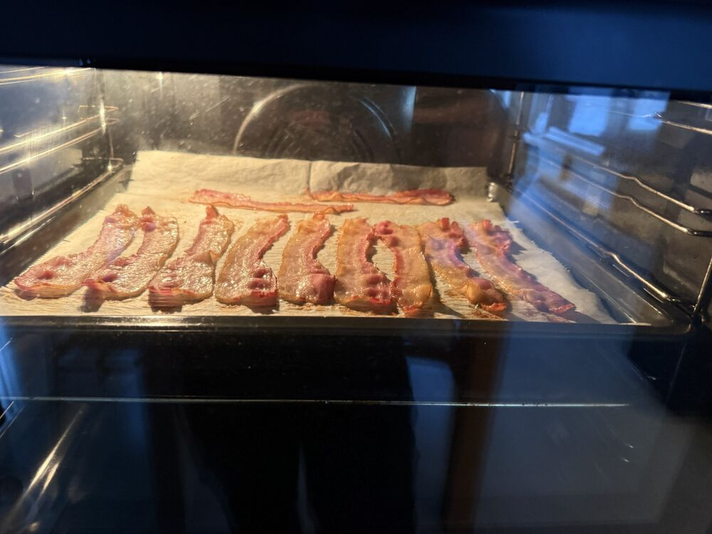
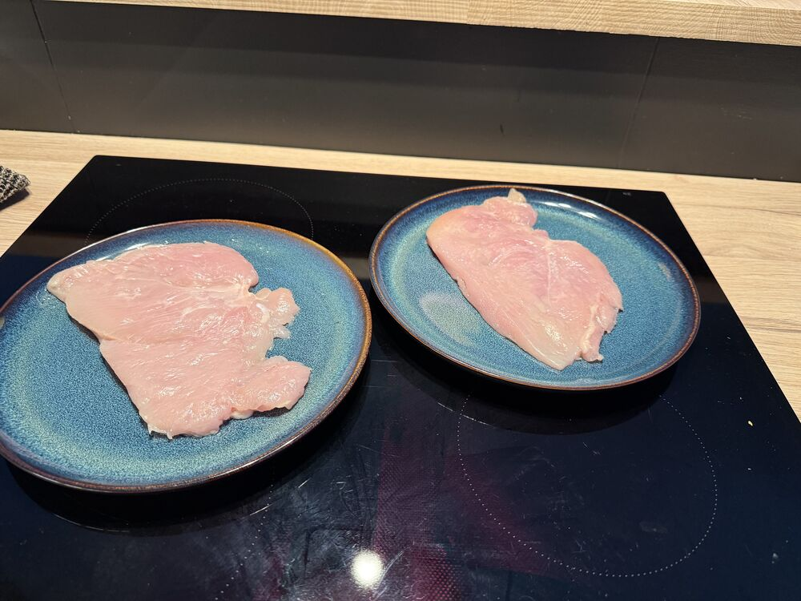
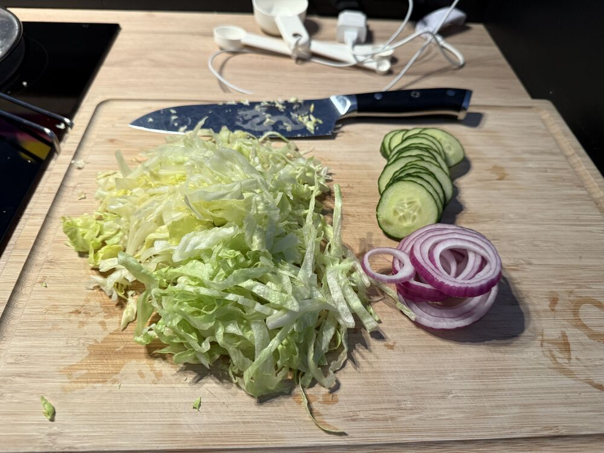
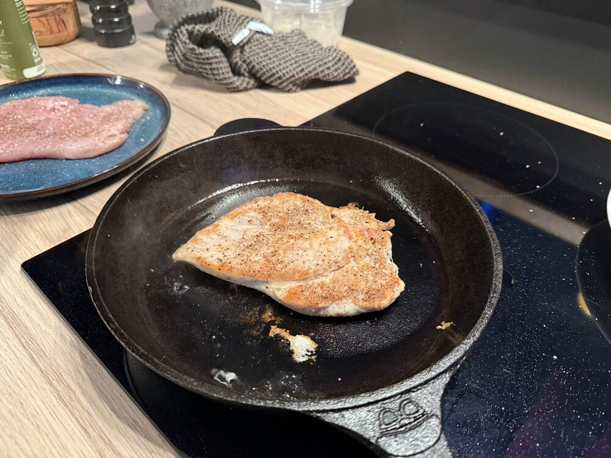
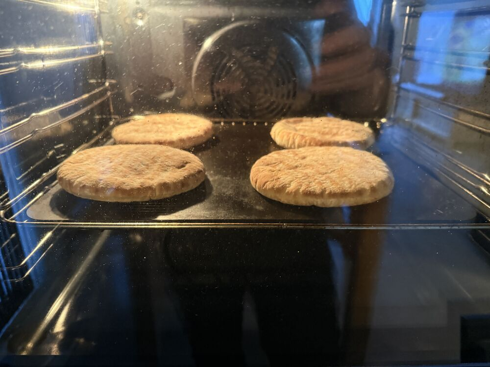

## Instructions

> [!tip] Tips, tricks & ideas
> Ommm nommm

   

1) 3 pieces of bacon per pita oven 200C 15min

   

2) Flatten chicken breast with skillet or meat hammer (~1.5cm thick)

   

3) What ever greens

   

4) Medium high hight (6/9) 4 mins per side

   

5) Heat bread of 3-4 mins per side.

# Lifesum
