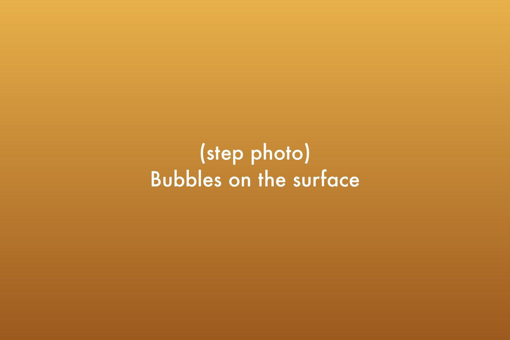

## Instructions

### Batter

1. Whisk the flour, sugar, baking powder, and salt together in a large bowl.
2. In a second bowl, whisk the eggs, milk, melted butter, and vanilla until combined.
3. Pour the wet ingredients into the dry and stir until *just* combined — a few lumps are fine. Overmixing makes tough pancakes. Rest the batter for 5 minutes.

### Cooking

1. Heat a nonstick pan or griddle over medium heat and grease lightly with butter.
2. Ladle about 60 ml of batter per pancake. Cook until bubbles form on the surface and the edges look set, 2–3 minutes.

   

3. Flip and cook another 1–2 minutes until golden. Serve warm with maple syrup.

## Tips

- For extra-fluffy pancakes, separate the eggs, whip the whites to soft peaks, and fold them in last.
- Leftovers freeze well: cool completely, freeze flat, and reheat in the toaster.
