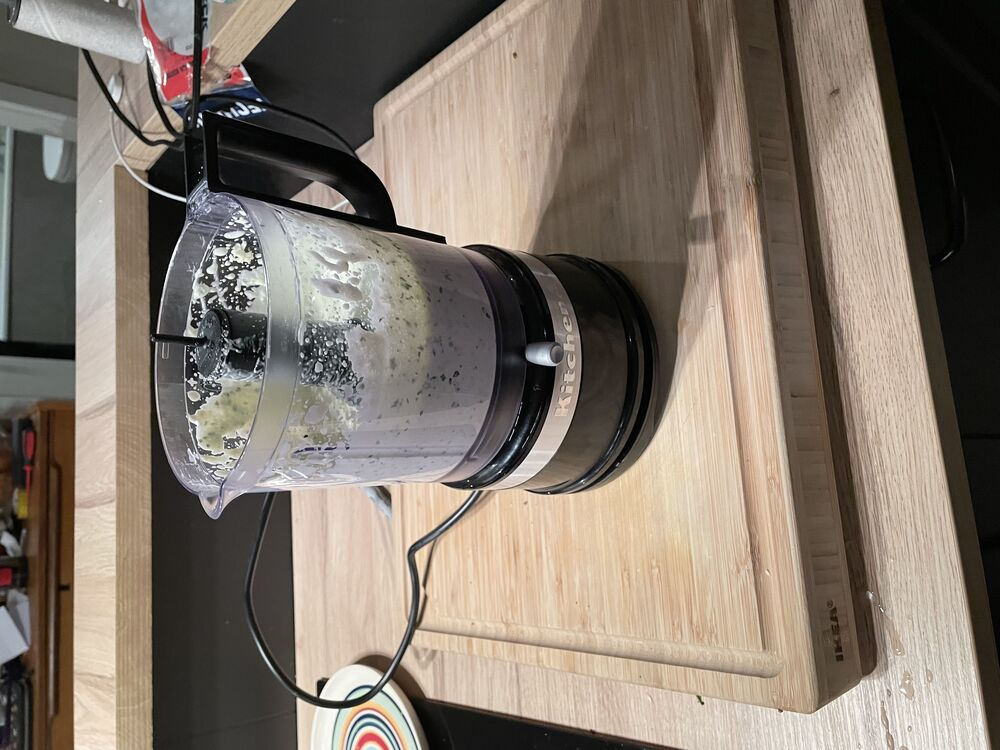

## Instructions

[See](https://www.youtube.com/watch?v=lkDat_Map10)

> [!info]
> - update lifesum!
> - Ég notaði aðeins minna pasta (átti ekki meira)
> - Mér fannst mega vera aðeins meiri sósa
> 	- Kannski var heimagerða mayoið ekki nógu þykkt
> - Ég gerði 2x skammt og setti bara grænmeti í helminginn
- Setja Mayo, sýrðan, hvítlauk og basil í blandara

   

- Mixa öllu saman og vola!

# Lifesum
