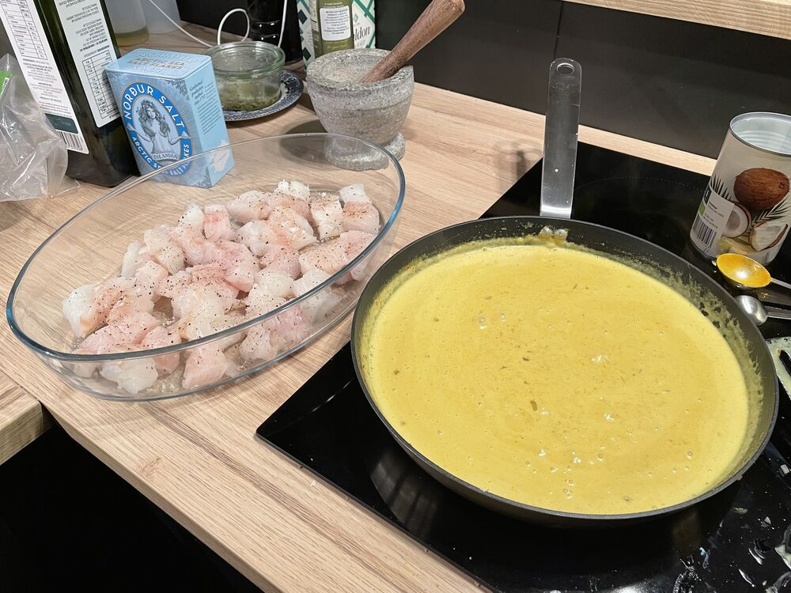

## Instructions

> [!note] 
> - Of mikil sósa
> - Kannski sleppa rjóma
> - Of mikill matur fyrir HRE
> - Of mikill laukur fyrir RFR

- Skola og þurrka fisk
- Skera fisk í 2-3cm kubba
- Setja fisk í eldfastmót og krydda með salt of pipar
- Skera laukinn í mjög litla bita
- Steikja laukinn í olíu þarf til gegnsær
- Bæta karry útá lauk og steikja í nokkrar mín
- Bæta kókósmjólk og rjóma útá
- Krydda til með kraft og salti
- Þykkja með mæis mjöli
- Hella yfir fisk
- Inní 180c ofn í 30 mín
Korean beef bowl (Bulgogi)#The rice

   

# Lifesum
