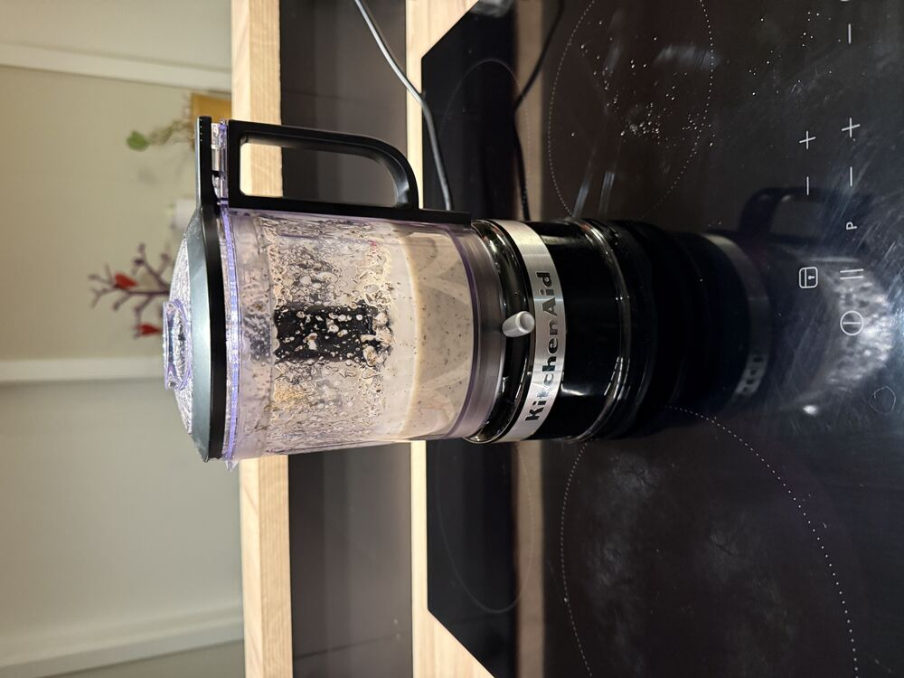
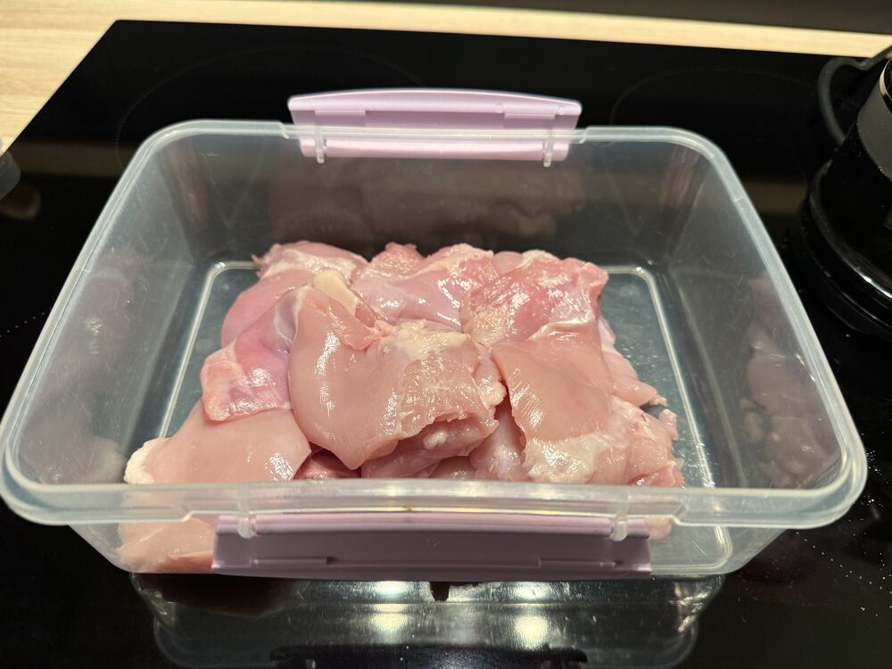
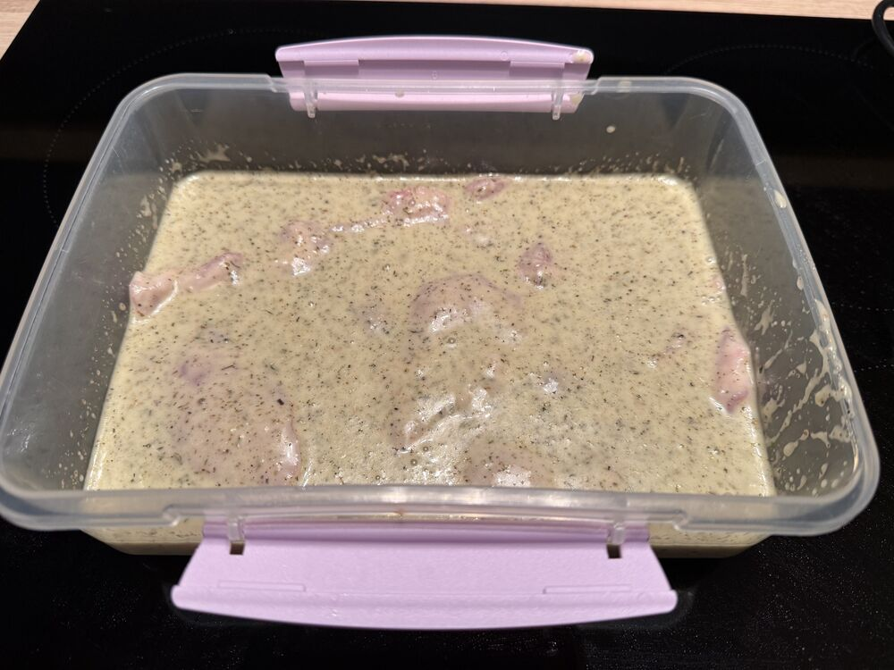
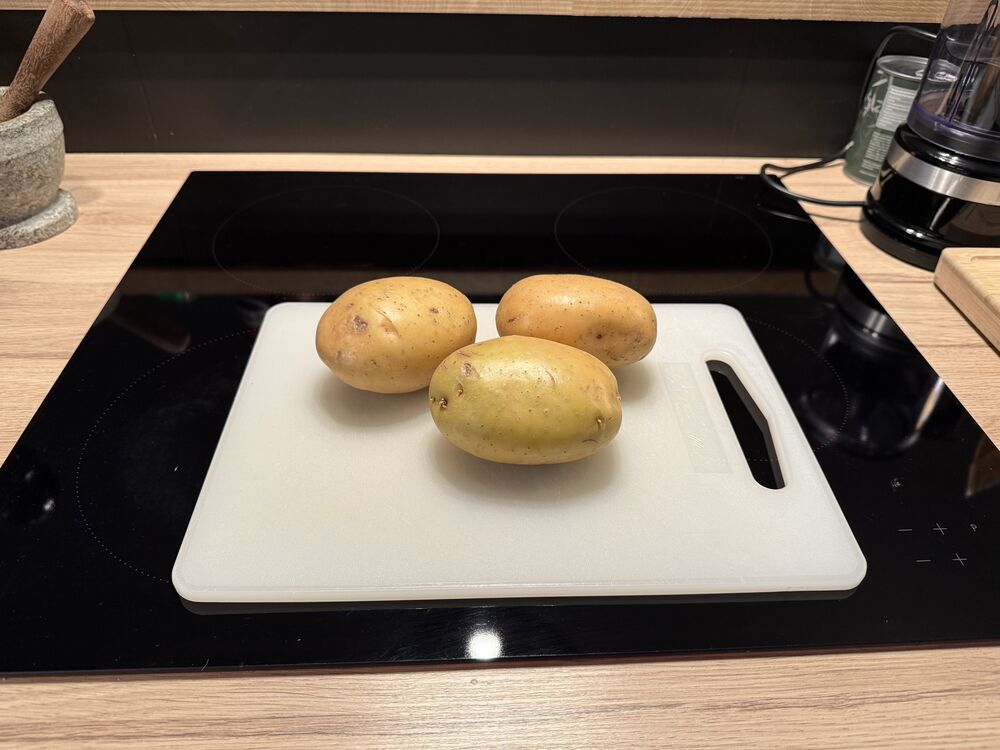
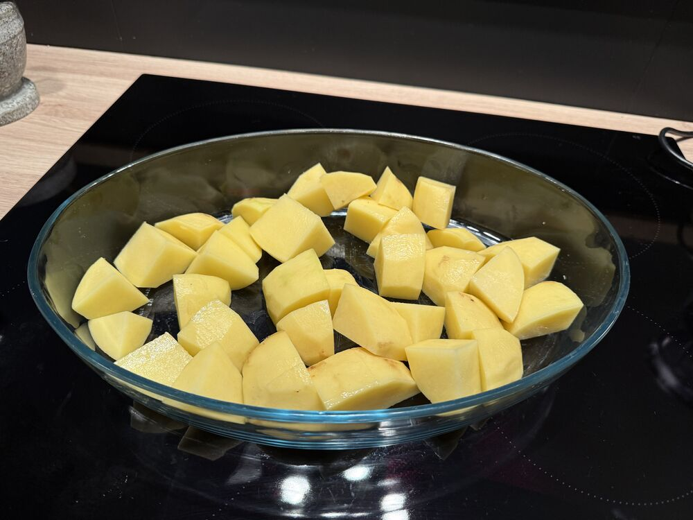
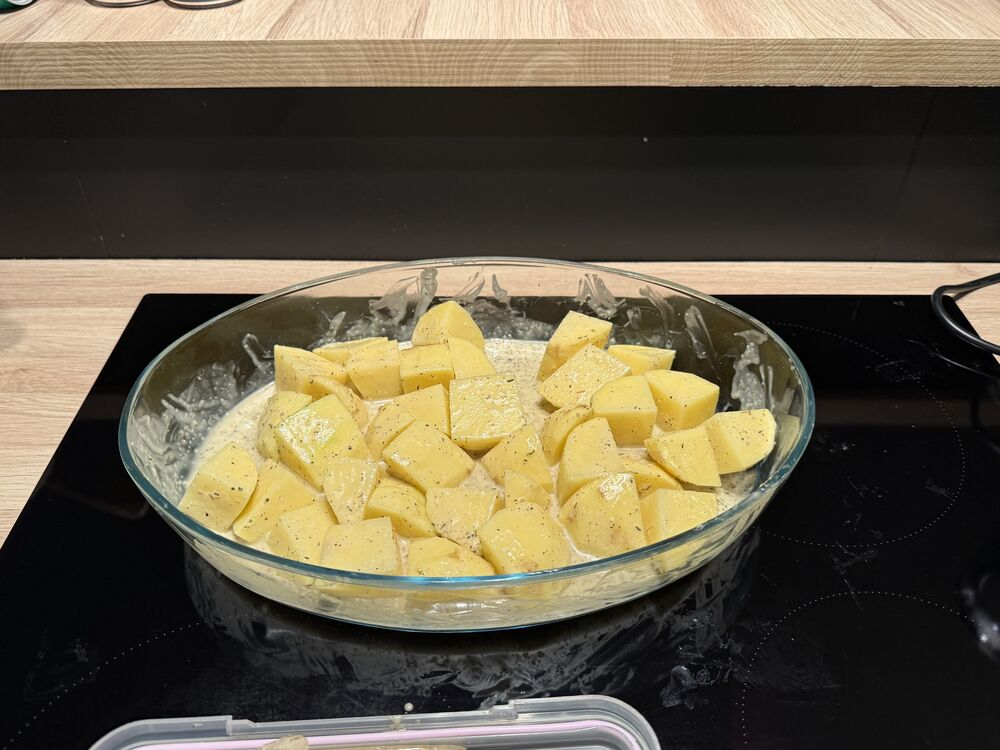
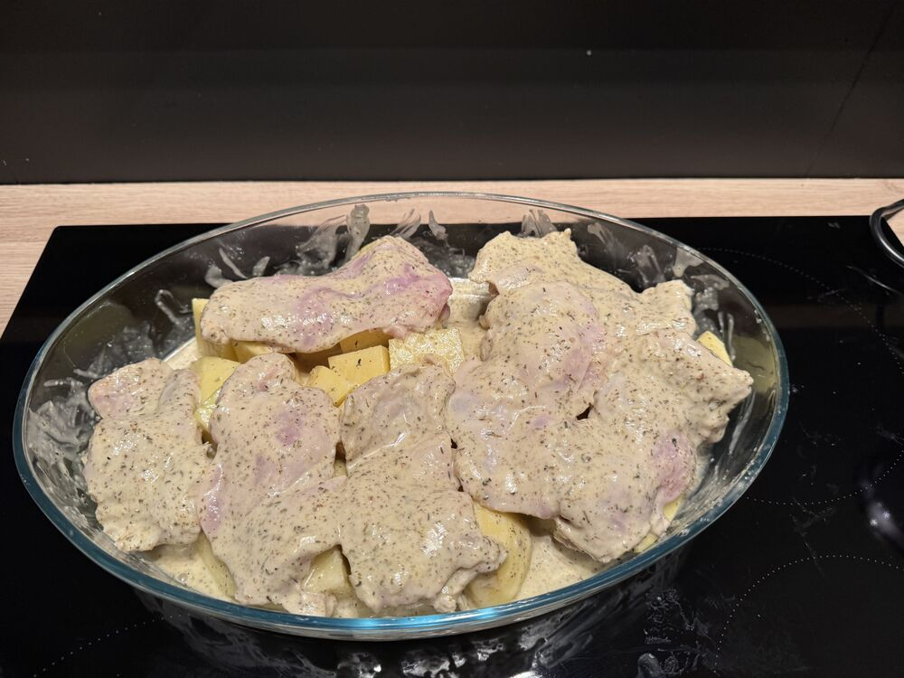
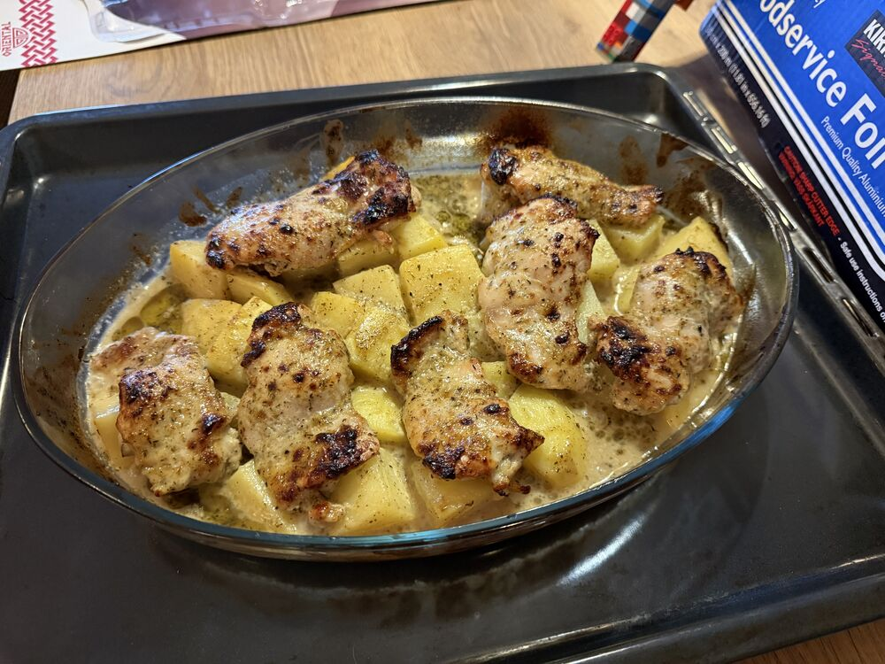

## Instructions

> [!tip] Tips, tricks & ideas
> - [See](https://www.sipandfeast.com/greek-lemon-chicken/#wprm-recipe-container-31743)

1) Marinade chicken over night

   

   

   

2) 

   

   

   

   

3) Ofn 220c í 40 mín
4) Taka kjúklingin af of auka 15 mín

   

# Lifesum
