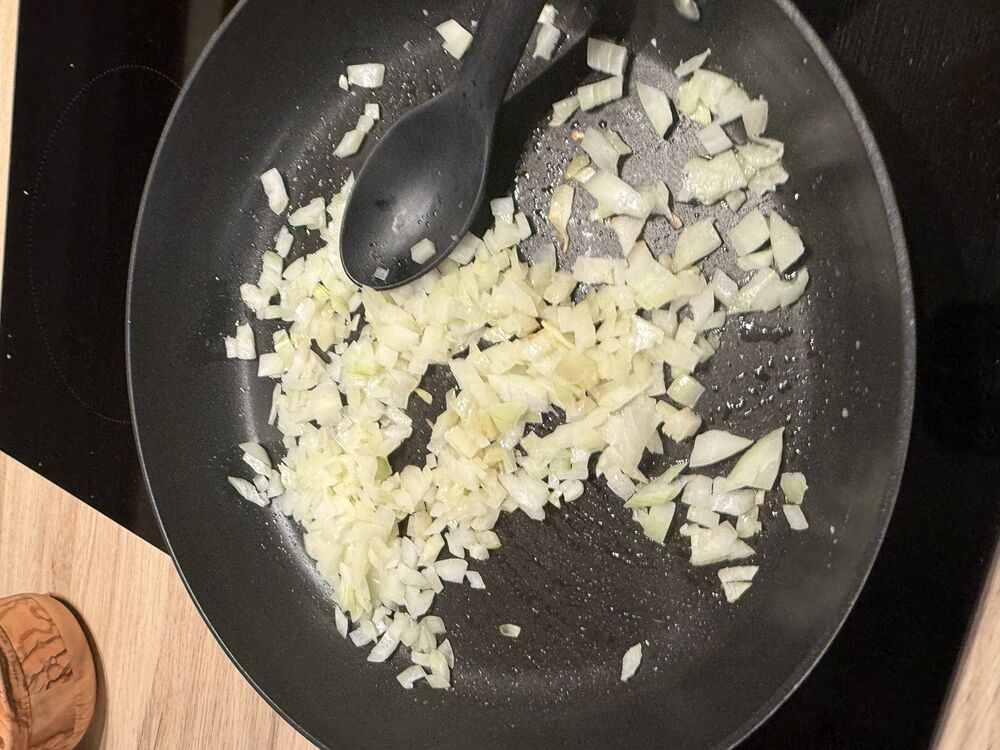
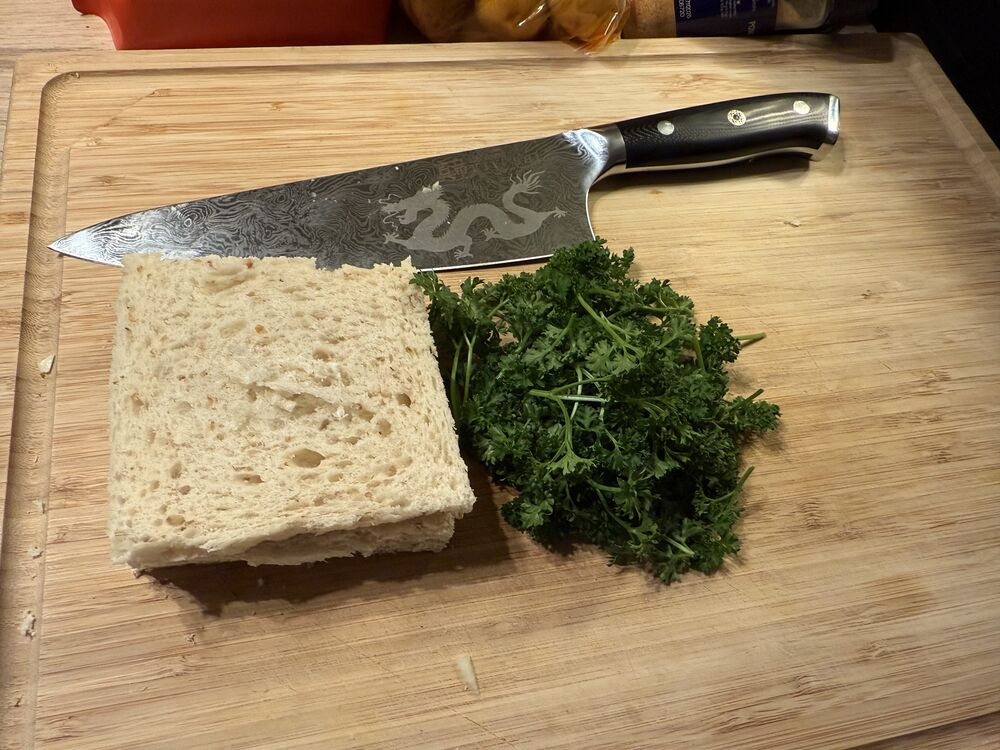
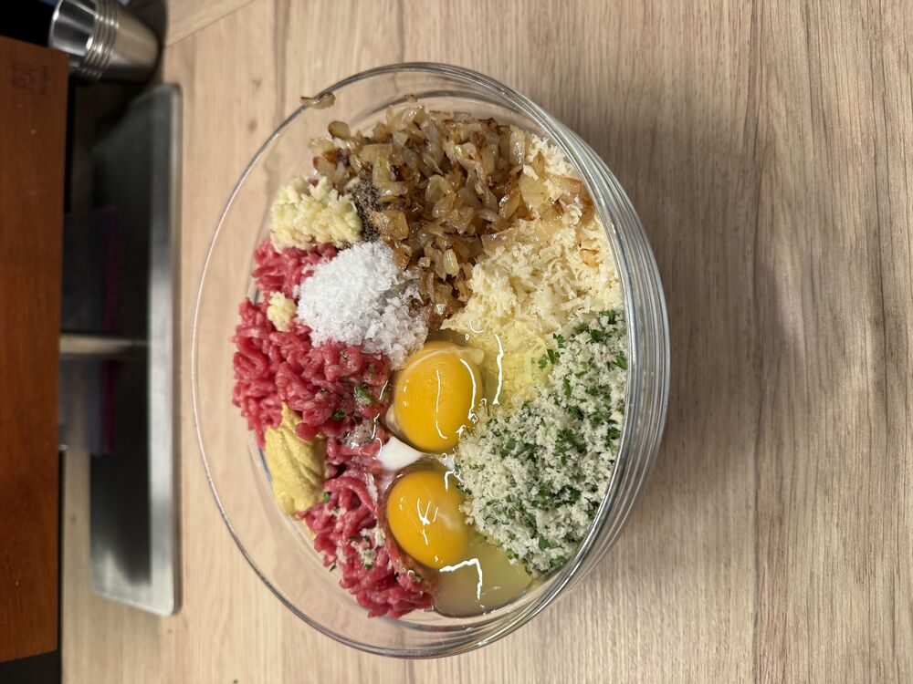
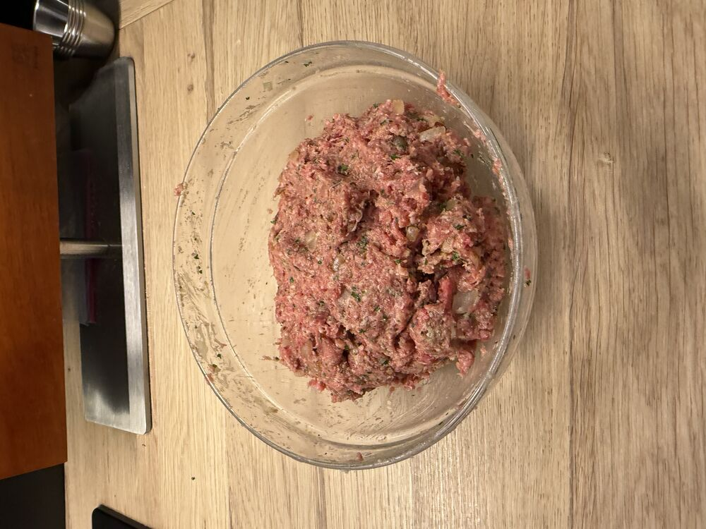
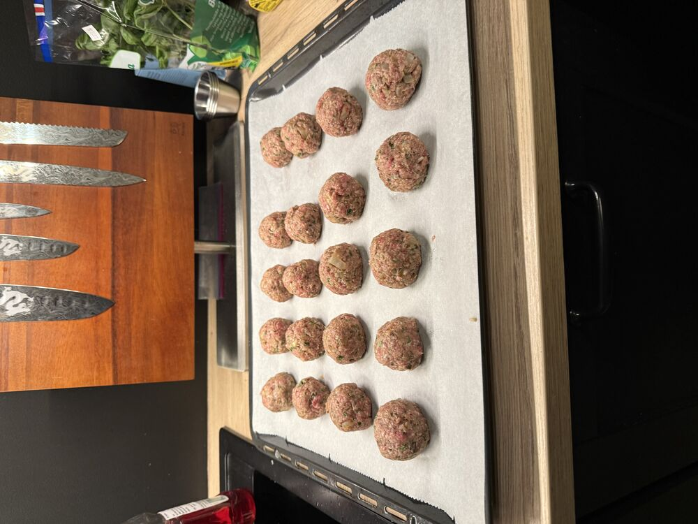
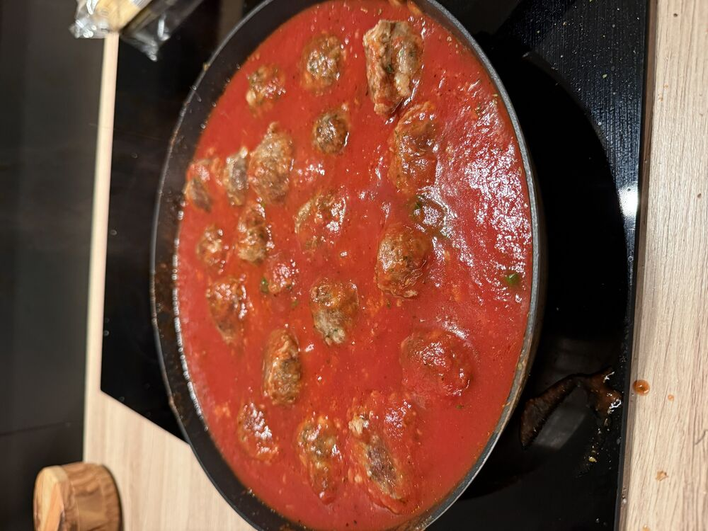

## Instructions

> [!tip] Tips, tricks & ideas
> Ommm nommm

# Mise en place

   

   

3)  Bollur

   

   

   

4)  Steikja á pönnu eða í ofn
	1)  Ofn 200c í 15 mín
5)  Hita sósu í pönnu, salt & pepper to taste (bónus:  basil, oregano, herb de provence).
6)  Þegar bollur koma úr ofninum beint í sósu

   

7)  Sjóða spagetti 400g (100g/portion)
8)  Hella vatni af spagetti. Setja smá olíu og sósu frá kjötbollum og blanda vel.
9)  Plate up!

# Lifesum!IMG_3767.png
