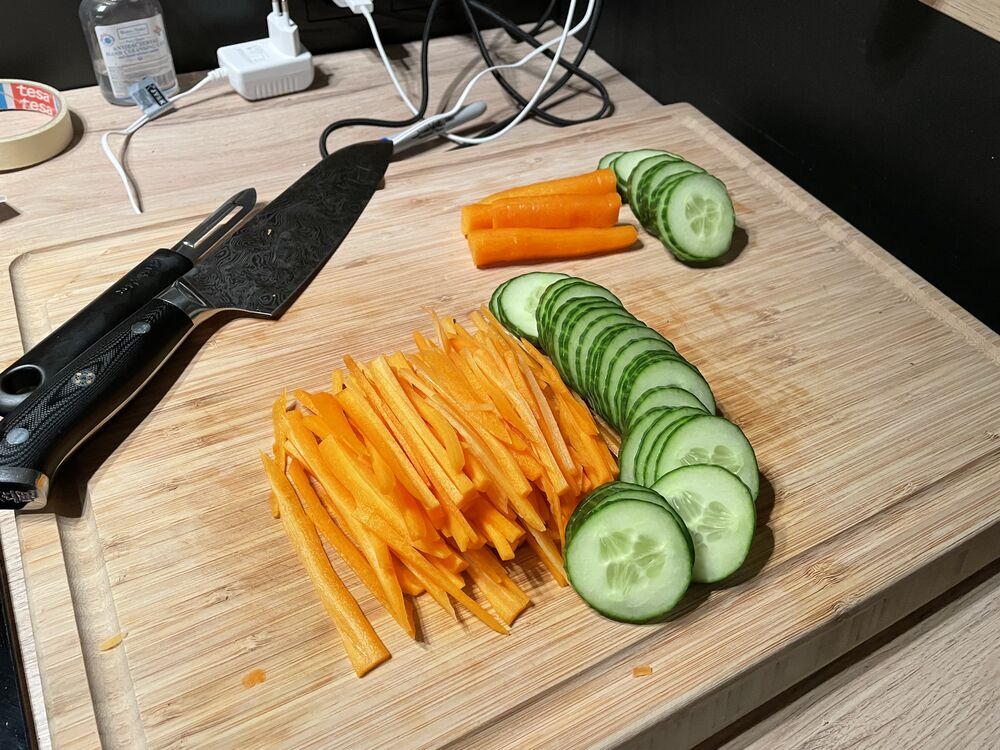
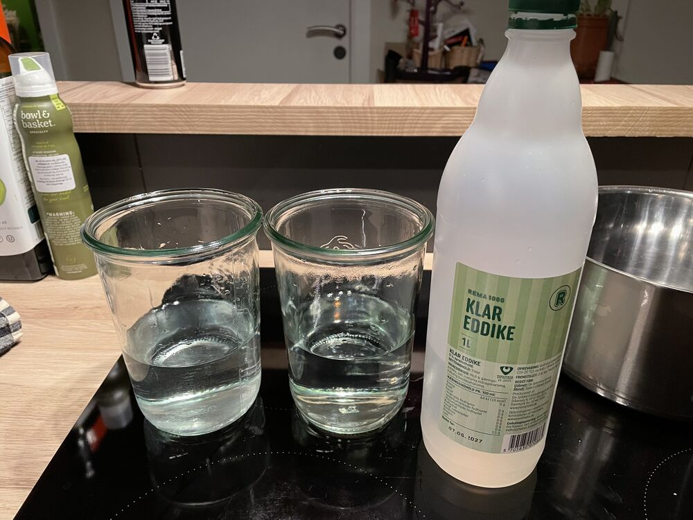
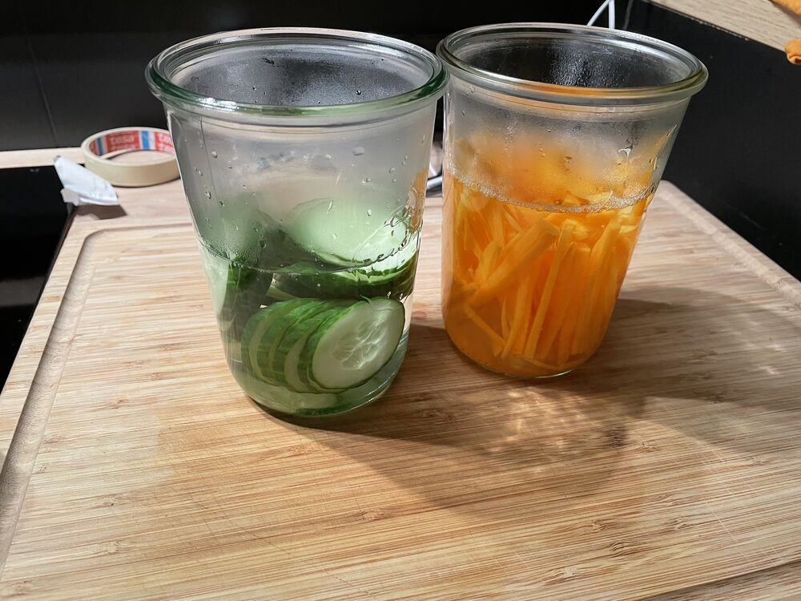
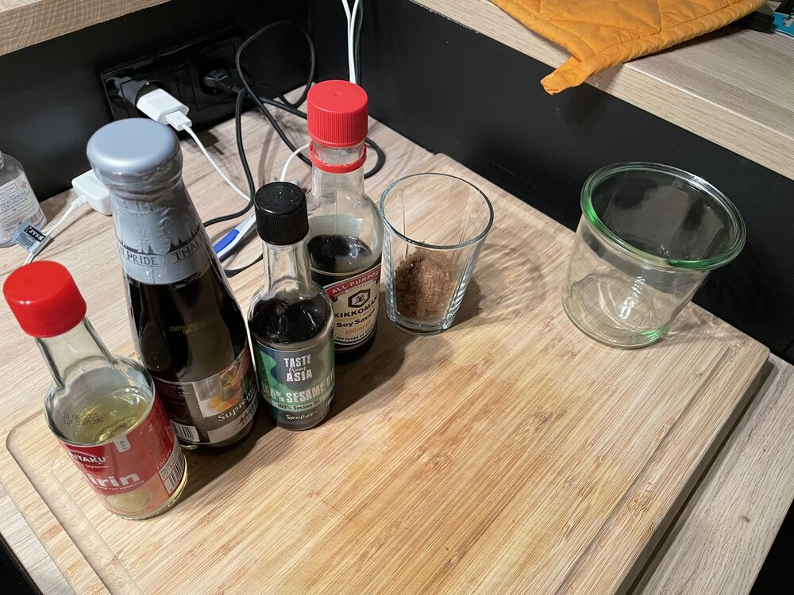
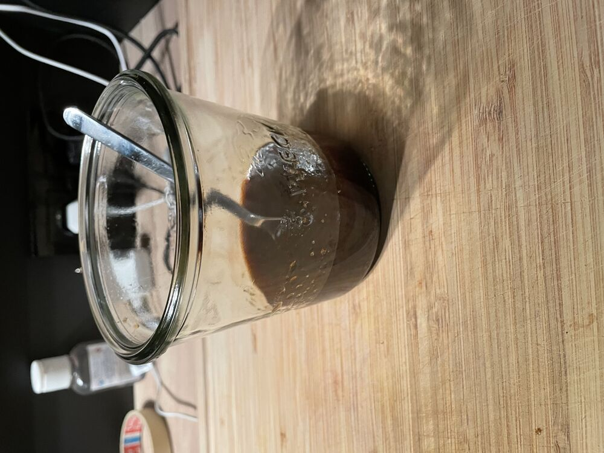
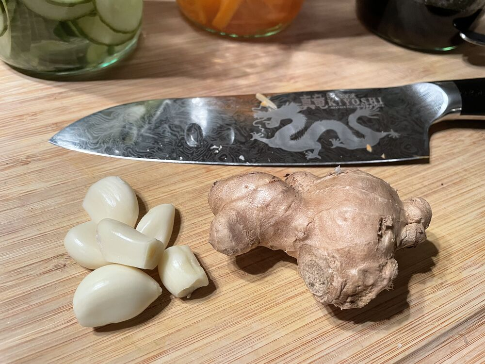
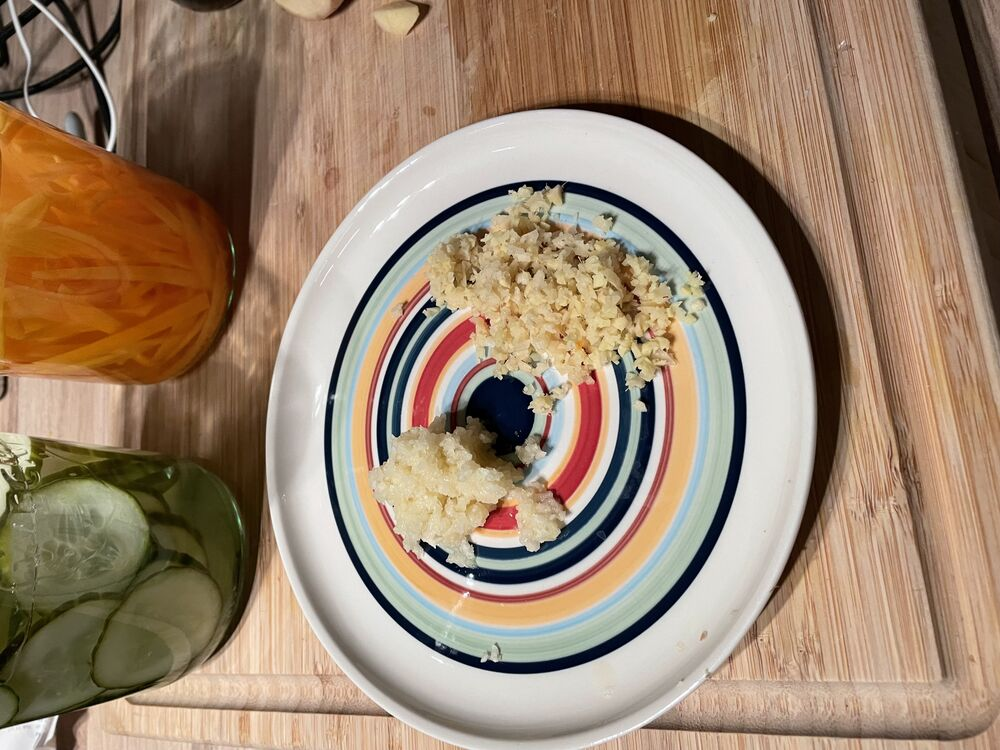

## Instructions

> [!tip] Gleymdi sesame fræjum
>  Toppa með chili crisp

1)  Best að byrja á Pickled gúrka og gulrætur. Jafnvel dögum áður.
2)  Blanda #Bulgogi Marinade. Gott að láta standa svo sykurinn leysist upp.
3)  Annað prep
	1) Rista sesame fræ
	2) Skera hálfan lauk
	3) Pressa/skera hvítlauk
	4) Rífa/skera engifer
	5) Skola rís
4)  Elda kjöt #The beef + sjóða rís #The rice

## Pickled gúrka og gulrætur
- hálf gúrka (ca. 250gr.)
- gulrætur (ca. 250 gr.)
- 350ml edit
- 350ml vatn
- Krydd (optional)
- Skera gúrku í sneiða
- Skera gulrætur í strimla!

   

- Setja 350 ml. lager edik og 350 ml. vatn í pot og ná upp suðu
- Setja gulrætur og gúrku í hrein ílát sem þola hita
- Hella edit og vatns blöndunni yfir.

   

   

## Bulgogi Marinade
Brúnn sykur 3 tbls (45 gr)
Soya 3 tbls 30gr.
Oyster 3 tbls 45gr
Mirin 2.5 tbls 15 gr
Sesame 2 tsp 10 gr

   

   

## The beef

1) Steikja sveppi upp úr smá olíu.
2) Bæta kjöti út á og elda þar til nánast tilbúið
3) Bæta hvítlauk og engifer steikja í 2-3 mín
4) Hella #Bulgogi Marinade út á (má bæta smá vatni)
5) Leyfa að þykkjast aðeins.

## The rice
1) Skola
2) Rís/Vatn ratio 1/1.5
3) ca. 100 gr. á mann
4) Salta vatn
	1) Soð og/eða krydd
5) Ná upp suðu
	1) Lækka niður í nánast ekkert
	2) Sjóða í 12 mín
	3) Leyfa að standa í 2 mín
	4) Fluff

   

   

# Lifesum
