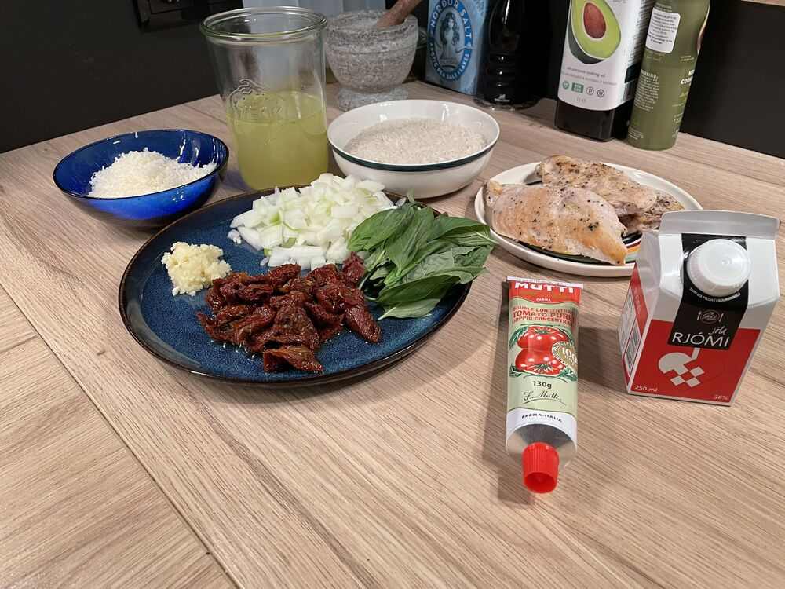
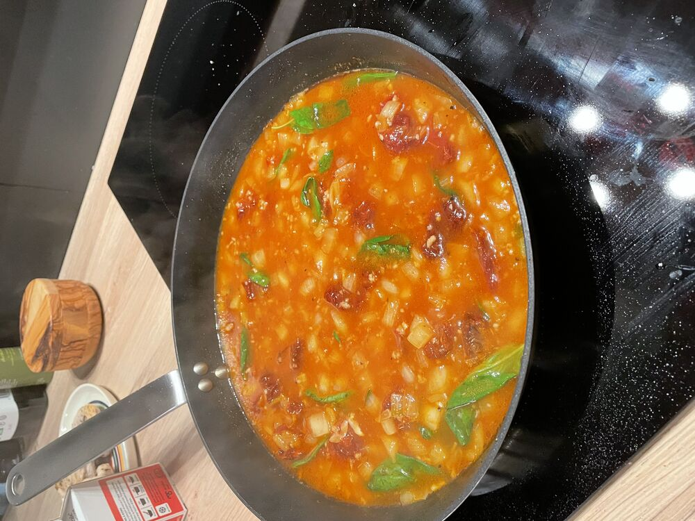
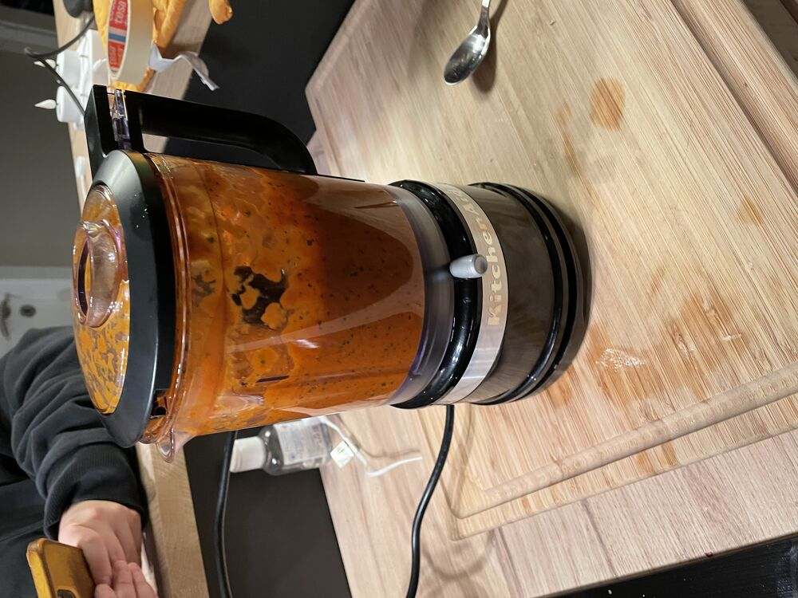

## Instructions

[See](https://www.youtube.com/watch?v=zq8_YSxFlKM)

>[!tip] Notes
> -  Minni sósu fyrir RFR næst
> -  Gera 2x sósu og frysta
> -  Nota sýrðan í staðinn fyrir rjóma
> 	- Oftar til, nýtist og færri kcal

   

2) Steikur kjúklingur með ofn kartöflum og pönnu sósu#Kjúklingur TODO: færa í generic folder
3) Á sama tíma #Marry me sósa og Korean beef bowl (Bulgogi)#The rice
4) Éta!

## Marry me sósa
1) Steikja lauk upp úr olíu (nota sólþurrkaða tómata olíuna) ca. 5 min

   

3) Setja tómat paste og risti í 3-4 mín
4) Setja tómata og hvítlauk steikja í ca. 2 mín
5) Hella soði útá og sjóða í nokkrar mín
	1) Setja 80% af basil útí! 

   

5) Í blandara

   

6) Sósuna aftur í pönnuna bæta við parmesan og rjóma
7) Restina af basil rétt í endann.
## Lifesum
