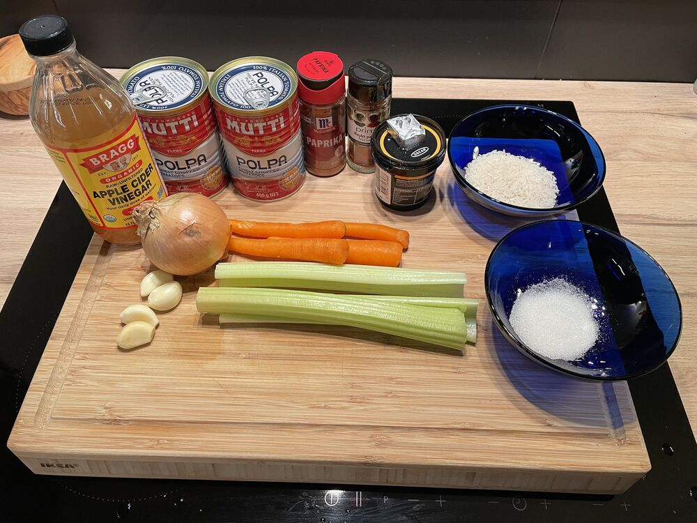
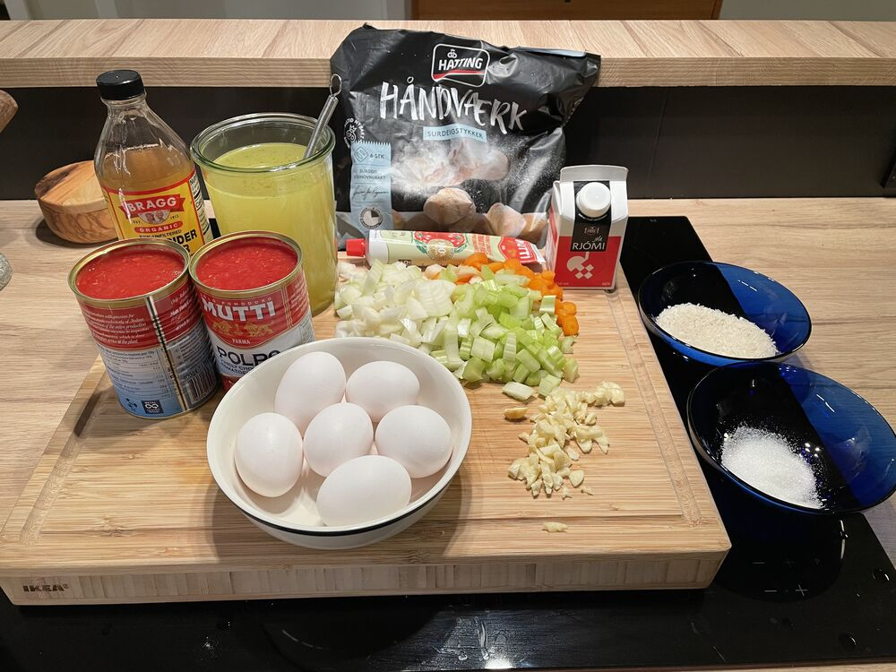
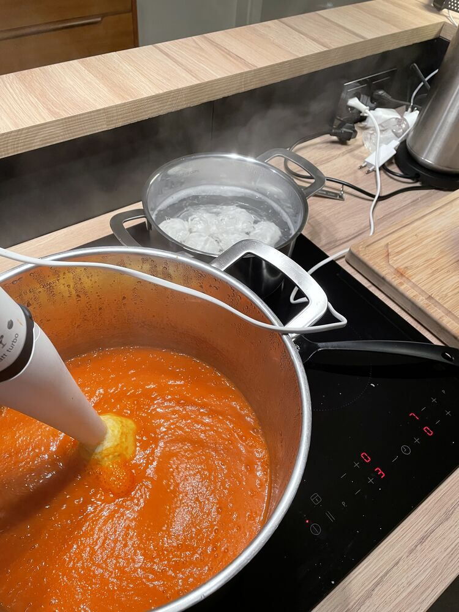

## Instructions

[See](https://www.youtube.com/watch?v=Q3CPURWTfhg)
> [!info]
> - OF HÁTT KCAL (bara eitt brauð næst) 
> - Gleymdi kryddum
> - Notaði ekki vín
> - Notaði ekki Worcestershire sause (notað smá soya í staðin)
1) Mise en place
	1) Skera lauk, celery, gulrætur og hvítlauk
	2) Undirbúa soð
	3) Vigta hrísgrjón
	4) Vigta Sykur

   

   

1) Steikja grænmeti "onion always number first"
	1) Lauk í 3-5 mín
	2) Svo gulrætur og celery í 5 mín í viðbót
	3) Hvítlauk í 2 mín
	4) Bæta kryddum
2) Setja tómat paste og rista í smá stund
3) Bæta útí tómötum og soði
4) Ná upp suðu
5) Hrísgrjón í loka á og sjóða í 20 mín
	1) Kveikjá á ofn og byrja sjóða egg
6) Blanda súpu vel með töfrasprota

   

8) Bæta útí sykur og rjóma 
9) Salt og pipar to taste.

# Lifesum
